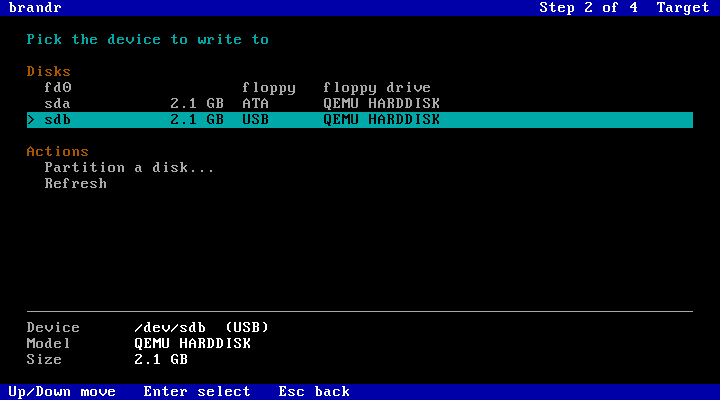
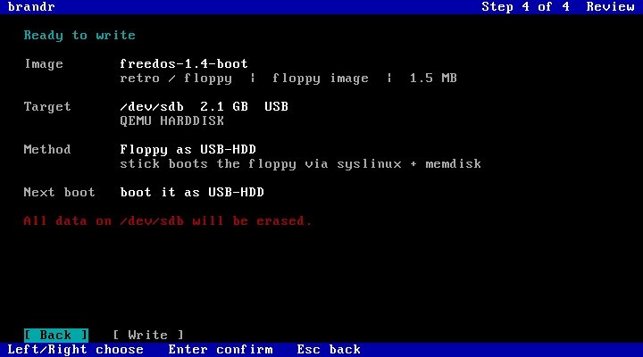

# brandr

**A network-streaming, wizard-driven fork of [caligula](https://github.com/ifd3f/caligula)**,
the lightweight disk imaging TUI by Astrid Yu. brandr writes a disk image **straight from an
HTTP server onto a local disk**: a USB stick, an IDE/SATA/NVMe disk, a CF card or a real floppy.
It never needs the image to fit in RAM, which makes it usable on a netbooted 256 MB Pentium.

It is the disk writer of [Pontifex](https://github.com/chibicitiberiu/pontifex) (a network boot
server with an auto-detecting ISO menu), but works with any HTTP server.

> brandr is an independent fork and is not affiliated with or endorsed by the caligula
> project. All of caligula's engine (write, verify, decompression, progress UI) is Astrid Yu's
> work. Upstream's README is kept in [docs/upstream-README.md](docs/upstream-README.md).

<p align="center">
  
  
  
  
</p>
<p align="center"><sub>The <code>--catalog</code> wizard on an 80x25 Linux text console (QEMU, 256 MB Pentium).</sub></p>

## What the fork adds
- **HTTP streaming input**: `brandr burn http://server/image.iso`. The size comes from `HEAD`,
  the data from a single streaming `GET`, and verification re-reads over HTTP. Memory use stays at a
  few MB whatever the image size.
- **Retries on network hiccups**: dropped connections, 30 s stalls and 5xx answers reconnect with
  `Range` at the exact byte, backing off 1 to 15 s, up to 8 tries per incident.
- **A full-screen, four-step wizard** fed by a JSON catalog (`--catalog URL`): pick the image, the
  target and the write method, then review. Esc goes back. It works on an 80x25 Linux VGA console.
- **Write methods** chosen per image and target: raw copy, **floppy sets** ("insert disk 2 of
  6"), a **floppy image as a USB-HDD or USB-ZIP** disk for old BIOSes, and **UEFI sticks** built
  from CD-only ISOs such as Windows (the server builds those layouts, brandr writes them).
- **Target list for netbooted machines**: whole disks only, with bus (USB/ATA/NVMe/SD/floppy).
  Floppy drives work even though they report 0 bytes. There's also a *Partition a disk...*
  entry that runs `cfdisk` and comes back.
- **Static builds for i586** (no SSE/CMOV) and x86_64.

## Usage
```sh
# stream one image to a disk (asks for the target, confirms, writes, verifies)
brandr burn http://10.0.0.10:8069/iso/tools/memtest86plus.iso

# the wizard: pick everything from a server's catalog
brandr burn --catalog http://10.0.0.10:8069/images.json --show-all-disks \
            --hash skip --compression auto --root never
```
Local files work as in caligula: `brandr burn image.img`.

## Catalog format
`--catalog` expects JSON like this (Pontifex serves it at `/images.json`):
```json
{ "images": [
  { "name": "memtest86plus-6.20", "section": "tools",
    "url": "http://server/iso/tools/memtest86plus-6.20.iso", "size": 6193152,
    "kind": "hybrid", "boot_hint": "USB-HDD / HDD",
    "set": null, "set_index": null, "set_size": null,
    "variants": [] }
]}
```
| Field | Meaning |
|---|---|
| `kind` | `hybrid` (ISO that also boots as a disk), `disk`, `floppy`, `cd-only`, `unknown` |
| `boot_hint` | shown to the user: how to boot the written disk |
| `set`, `set_index`, `set_size` | multi-disk sets (floppy installers): shared id, 1-based position, total |
| `variants[]` | alternative layouts the server can produce: `{method, url, size, boot_hint, state, status_url}`. `method` is `usb-hdd`, `usb-zip` or `uefi`. `size` may be null until built. While `state` is `building`, brandr polls `status_url` (`{state, step, size, error}`) |

URLs must be plain `http://` with percent-encoded paths. The server must send `Content-Length`
and honour `Range: bytes=N-`.

## Building
```sh
cargo build --release                 # native build: target/release/brandr
scripts/build-static.sh               # static i586 + x86_64 in containers -> dist/
```
Release binaries are attached to [GitHub releases](https://github.com/chibicitiberiu/brandr/releases).

The Nix flake, AUR and Debian packaging files come from upstream and are **not maintained in
this fork** (they still build `caligula`).

## License
GPL-3.0, like caligula. Copyright of the original code remains with its authors; see
[LICENSE](LICENSE) and the git history.
